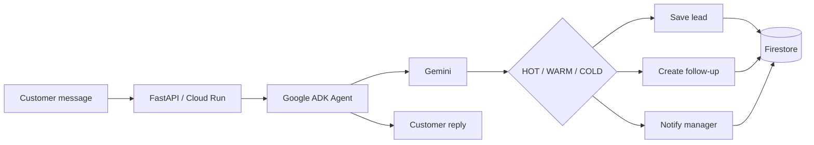

# LeadPilot

**LeadPilot is an autonomous AI sales operator for service businesses.**  
It takes an incoming customer message, qualifies the lead, writes it to CRM, schedules the next follow-up, and escalates to a human only when the opportunity needs attention.

**Live demo:** https://leadpilot-agent-590163484801.europe-central2.run.app

---

## What it does

A typical lead does not arrive as clean CRM data. It arrives as a message like:

> Хочу тепловий насос для утепленого будинку 160 м² у Нетішині. Є водяна тепла підлога і 3 фази. Хочу купити найближчими днями, передзвоніть мені для підбору.

LeadPilot turns that message into:

- the customer's need;
- known and missing information;
- a `HOT`, `WARM`, or `COLD` qualification;
- the next sales action;
- a customer reply;
- an internal manager note;
- a real Firestore CRM record;
- a follow-up task when appropriate;
- a manager escalation when appropriate.

The important part is that the agent does not only *describe* those actions. It executes them.

---

## Demo behavior

| Lead | CRM | Follow-up | Human escalation |
|---|---|---|---|
| `HOT` | ✅ Saved | ✅ 1–4 hours | ✅ High priority |
| `WARM` | ✅ Saved | ✅ Scheduled | — |
| `COLD` | ✅ Saved | — | — |

The web demo shows the resulting Firestore-backed actions after each run, including the real lead ID.

---

## How it works

1. A customer message is submitted to the FastAPI web app.
2. A Google ADK agent uses Gemini to understand the request and extract useful facts.
3. The agent qualifies the lead as `HOT`, `WARM`, or `COLD`.
4. LeadPilot saves the structured lead to Firestore.
5. Deterministic tool rules decide which actions are allowed.
6. LeadPilot creates a follow-up and/or manager notification when required.
7. The UI verifies the new Firestore records and shows what was actually executed.



---

## Guardrails

LeadPilot uses the model for language understanding and reasoning, but business-critical actions are constrained in code.

Examples:

- `HOT` leads may create a manager notification and a near-term follow-up.
- `WARM` leads may create a follow-up but do not trigger an urgent manager alert.
- `COLD` leads are saved to CRM without unnecessary escalation.
- downstream actions must use the real Firestore lead ID returned by the CRM write.
- the agent is instructed not to invent equipment capacity, pricing, compatibility, savings, or installation requirements when the available data is insufficient.

For technical sales, this matters: if an engineering calculation is needed, LeadPilot asks for the missing data instead of guessing.

---

## Stack

| Component | Used for |
|---|---|
| Gemini | intent understanding, extraction, qualification, response generation |
| Google Agent Development Kit | agent runtime and tool calling |
| Firestore | leads, follow-ups, manager notifications |
| Cloud Run | public FastAPI application |
| Secret Manager | Gemini API credential |
| Google Cloud IAM | runtime service account and scoped access |
| FastAPI | demo/API layer |

---

## Firestore

The current prototype uses three collections:

```text
leads
followups
manager_notifications
```

A lead is written first. Follow-ups and manager notifications reference that lead through its actual Firestore document ID.

This makes it possible to verify that the visible workflow corresponds to persisted business state rather than a model-generated claim.

---

## Public demo

The public demo includes basic protection against accidental abuse:

- one Cloud Run instance maximum;
- Cloud Run concurrency limited for the demo;
- maximum customer message length of 2,000 characters;
- per-IP workflow rate limiting;
- Gemini API key stored in Secret Manager;
- `.env` excluded from source deployment;
- dedicated Cloud Run service account.

Try the demo here:

**https://leadpilot-agent-590163484801.europe-central2.run.app**

---

## Run locally

### Requirements

- Python 3.12+
- `uv`
- Gemini API access
- Google Cloud project with Firestore

Install dependencies:

```bash
uv sync
```

Create a local `.env` file:

```env
GEMINI_API_KEY=your_key_here
```

Authenticate Application Default Credentials:

```bash
gcloud auth application-default login
```

Run the web demo:

```bash
uv run uvicorn app.web_demo:app --host 127.0.0.1 --port 8081
```

Open:

```text
http://127.0.0.1:8081
```

---

## Deploy to Cloud Run

The repository includes a `Dockerfile` configured for the web demo.

Example source deployment:

```bash
gcloud run deploy leadpilot-agent \
  --source . \
  --region europe-central2 \
  --allow-unauthenticated
```

For the deployed demo, `GEMINI_API_KEY` is provided through Google Secret Manager rather than committed to the repository.

---

## Repository

```text
app/
├── agent.py          # agent instructions, tools and routing rules
├── web_demo.py       # FastAPI demo and Firestore action verification
├── fast_api_app.py
└── app_utils/

tests/
Dockerfile
pyproject.toml
uv.lock
.env.example
.gcloudignore
.gitignore
README.md
```

---

## Current prototype

Working today:

- Gemini-powered lead analysis;
- structured known/missing-data extraction;
- `HOT` / `WARM` / `COLD` qualification;
- Firestore CRM persistence;
- follow-up creation;
- guarded human escalation;
- customer-facing reply;
- manager note;
- public Cloud Run deployment;
- Firestore-verified action status in the web UI.

The next product step is connecting the same workflow to real lead sources and manager channels instead of the demo input box.
